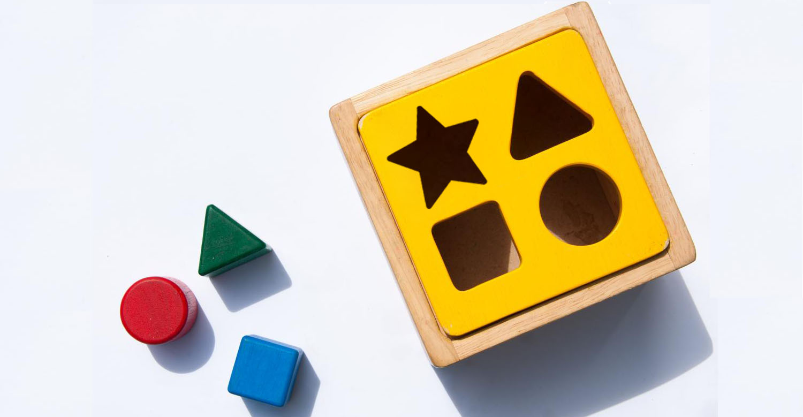
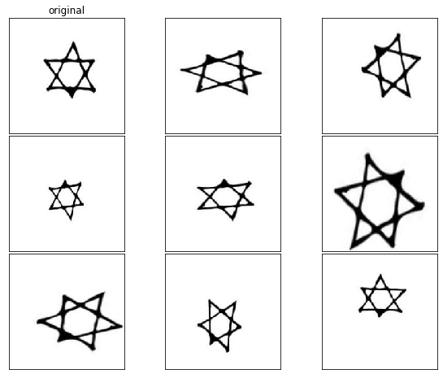
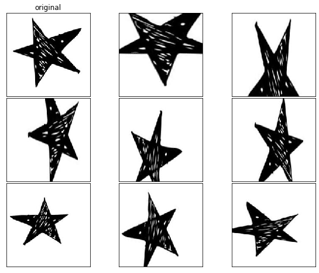
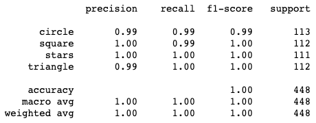

# Shapes Image Classification - Using Convolutional Neural Networks

Flatiron Final Project - Shapes Image Classifier CNN

I wanted to make a image classifier using a convolutional neural network model. As well make system where I can feed a image and predict the correct class. Convolutional neural networks are one of many “deep learning” models; that works great with images and videos processing.

I made a Convolutional Neural Network to predict; a hand drawn shape, and classify if the image is one of four shapes (Circles, Squares, Stars or Triangles).

I also made a drag and drop predictor. The app is running my model and will display the percentage the model thinks the shape is, Circle, Square, Star or Triangle.

## What Did I Do?

* Imported 2 image databases off Kaggle on shapes (Started with solid and outline shapes of circle, square and triangle)

* Manually scraped, cleaned and labeled 1000+ images to add stars as a shape (also added more hand drawn shapes).

* Did some basic Exploratory Data Analysis:

    All of the images in my dataset is in .png format.
    After splitting the dataset (4,480 total images) into Train/Test( 90/10 split ) of each shape:

    Total number of images in circles training set: 1013   --   Total number of images in circles test set:      114
    Total number of images in squares training set: 1013   --   Total number of images in squares test set:      113
    Total number of images in stars training set: 1002   --   Total number of images in stars test set:      112
    Total number of images in triangles training set: 1008   --   Total number of images in triangles test set:      113

    I made a collage, in photoshop, of a sampling of images of each shape, by their Label

* Made the Neural Network.

* I then tuned my ImageDataGenerator, which allowed me to manipulate images to produce variations of an original image. This helped increase your data pool with the augmented version of original images.

Samples of the ImageDataGenerator in action:
   

* After training my model through 50 epochs and I calculated the average of the last ten epochs' of accuracy score (97.11%), average loss (0.084) and the average MSE (0.010). My model is performing very well as I have the classification report and the confusion matrix of my model's predictions

Classification Report of model's performance

Confusion Matrix of model's performance

* Finally I made a Streamlit (front-end) to live demo my model  

## Built With

* Python3.8
* Jupyter Notebook 6.0.0
* A few imports: pandas, numpy, matplotlib.pyplot, seaborn, statsmodels and sklearn

## Authors

* **Samuel Diaz** - *Creator* - [sdman135](https://github.com/sdman135/)
